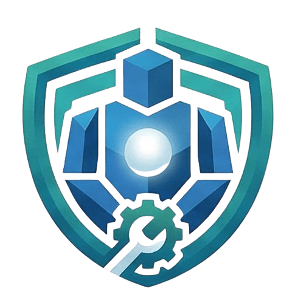

<p align="center">
  
</p>

<h1 align="center">OpenGolem — Open-Source Claude Cowork with OAuth</h1>

<p align="center">
  Open-source Claude Cowork for Windows and macOS — a Claude Cowork alternative with OAuth support for Gemini, Codex, and Antigravity.
</p>

<p align="center">
  <a href="#features">Features</a> •
  <a href="#installation">Download</a> •
  <a href="#quick-start">Quick Start</a> •
  <a href="#architecture">Architecture</a> •
  <a href="#contributing">Contributing</a>
</p>

<p align="center">
  
  
  
</p>

---

## Introduction

**OpenGolem** is an **open-source version of Claude Cowork** and a **Claude Cowork alternative** for people who want a desktop AI cowork app with more flexible authentication.

Right now, it is also a **fork/rebrand of Open-Cowork** — another open-source Claude Cowork implementation — with a new identity and a different product direction.

The main reason to use OpenGolem is simple:

- **OAuth support for Gemini, Codex, and Antigravity**
- **Use your existing Gemini, Codex, and Antigravity accounts**
- **Avoid the need for costly API calls when those plans already cover your usage**
- **Use an AI app without API keys for supported OAuth providers**
- fall back to standard API providers when you want them

OpenGolem gives you a desktop AI cowork app with a local workspace, tool execution, skills, MCP support, GUI operation, and remote-control capabilities — packaged for **Windows** and **macOS**.

If you are searching for terms like **cowork OAuth**, **Claude OAuth**, **open-source OAuth app**, **desktop AI app with OAuth**, or **AI app without API key**, OpenGolem is designed to sit directly in that category.

> [!WARNING]
> OpenGolem can read files, modify files, and operate tools inside your workspace. Treat it like a powerful local operator, not a toy. Review what it is allowed to touch.

---

<a id="features"></a>
## Features

### Core positioning

- **Open-source Claude Cowork experience**
- **Claude Cowork alternative** for desktop users
- **Desktop AI agent app** with one-click installers for **Windows** and **macOS**
- **OAuth-first workflow** for supported providers
- **API-key workflow** for other providers

### Authentication and model access

- **OAuth support** for:
  - **Gemini**
  - **Codex**
  - **Antigravity**
- **Cowork OAuth / Claude OAuth style login flow** for supported providers
- **Use your existing accounts instead of API keys** where OAuth is supported
- **API provider support** for OpenAI-compatible and Anthropic-style setups
- Flexible model/provider configuration inside the app

### Local AI cowork workflow

- **Workspace-scoped file management**
- **Chat-based task execution** inside your selected working folder
- **Real-time trace panel** for reasoning and tool execution visibility
- **Multimodal input** with drag-and-drop files and images

### Skills and tools

- Built-in **Skills** support for:
  - PPTX
  - DOCX
  - PDF
  - XLSX
- **Custom skill creation and deletion**
- **MCP connector support** for external tools and services

### Desktop control and remote operation

- **GUI operation** for desktop apps
- **Remote control** support for connected platforms and services
- **Feishu / Lark-style collaboration flows** supported in the current codebase

### Safety and isolation

- **Workspace path restrictions**
- **WSL2 isolation on Windows**
- **Lima isolation on macOS**
- Native fallback when VM isolation is unavailable

---

<a id="installation"></a>
## Download

### Option 1: Download Installer

Get the latest version from this repository’s **Releases** page.

If you want an **open-source Claude Cowork app**, a **desktop AI app with OAuth**, or a **Claude Cowork alternative** you can download and run locally, start here.

| Platform | File Type |
|----------|-----------|
| **Windows** | `.exe` |
| **macOS** (Apple Silicon) | `.dmg` |

### Option 2: Build from Source

```bash
git clone https://github.com/luckeyfaraday/OpenGolem.git open-golem
cd open-golem
npm install
npm run rebuild
npm run dev
```

To build installers locally:

- **Windows:** `npm run build:win`
- **macOS/Linux:** `npm run build`

If you update the app icon, regenerate the derived packaging assets first:

```bash
npm run build:icons
```

### Windows release automation

Pushing a Git tag triggers [`.github/workflows/windows-release.yml`](.github/workflows/windows-release.yml), which builds the Windows installer on `windows-latest` and uploads release assets to the matching GitHub release.

---

## Sandbox and security

OpenGolem supports multiple isolation levels:

| Level | Platform | Technology | Description |
|-------|----------|------------|-------------|
| **Basic** | All | Path Guard | File operations restricted to the selected workspace |
| **Enhanced** | Windows | WSL2 | Commands execute in an isolated Linux VM |
| **Enhanced** | macOS | Lima | Commands execute in an isolated Linux VM |

### Windows

When **WSL2** is available, Bash commands are routed through an isolated Linux VM and the workspace is synced bidirectionally.

Install WSL if needed:
- <https://docs.microsoft.com/en-us/windows/wsl/install>

### macOS

When **Lima** is installed, commands run inside an Ubuntu VM with `/Users` mounted.

Install Lima:

```bash
brew install lima
```

---

<a id="quick-start"></a>
## Quick Start

### 1. Choose how you want to authenticate

#### OAuth providers
Use your existing accounts for:
- **Gemini**
- **Codex**
- **Antigravity**

#### API providers
For other providers, configure them with API credentials.

| Provider | Base URL | Example Models |
|----------|----------|----------------|
| **OpenRouter** | `https://openrouter.ai/api` | OpenRouter-supported models |
| **Anthropic** | default | Claude models |
| **Zhipu AI (GLM)** | `https://open.bigmodel.cn/api/anthropic` | `glm-4.7`, `glm-4.6` |
| **MiniMax** | `https://api.minimaxi.com/anthropic` | `minimax-m2` |
| **Kimi** | `https://api.kimi.com/coding/` | `kimi-k2` |

### 2. Configure the app

1. Open **Settings**
2. Choose your auth method:
   - OAuth for Gemini / Codex / Antigravity
   - API key + base URL for other providers
3. Select the model/provider you want to use
4. Choose your workspace folder

### 3. Start using OpenGolem

Example prompt:

> Read the files in this workspace, summarize the key documents, and generate a PowerPoint briefing.

### Notes

#### macOS gatekeeper
If macOS blocks the app, go to **System Settings → Privacy & Security** and choose **Open Anyway**.

If needed:

```bash
sudo xattr -rd com.apple.quarantine "/Applications/OpenGolem.app"
```

#### Network access
For networked tools such as web search or remote connectors, your proxy/network setup may need TUN / virtual interface support.

#### Notion connector
If you use Notion integrations, you may need to configure both the token and the page-level connection permissions.

---

<a id="skills"></a>
## Built-in skills

OpenGolem ships with built-in skills under `.claude/skills/`, including:

- `pptx`
- `docx`
- `pdf`
- `xlsx`
- `skill-creator`

---

<a id="architecture"></a>
## Architecture

```text
open-golem/
├── src/
│   ├── main/                    # Electron main process
│   │   ├── claude/              # Agent runner and provider logic
│   │   ├── config/              # Persistent configuration
│   │   ├── credentials/         # Auth / credential handling
│   │   ├── mcp/                 # MCP-related runtime
│   │   ├── oauth/               # OAuth support
│   │   ├── remote/              # Remote-control config/runtime
│   │   └── utils/               # Shared helpers
│   ├── preload/                 # Electron preload bridge
│   └── renderer/                # React frontend
├── .claude/skills/              # Built-in skills
├── resources/                   # Static assets
├── electron-builder.yml         # Packaging config
├── vite.config.ts               # Frontend build config
└── package.json                 # Scripts and dependencies
```

---

<a id="contributing"></a>
## Contributing

Contributions are welcome.

1. Fork the repo
2. Create a branch
3. Make your changes
4. Open a PR

---

## License

MIT © OpenGolem Team

---

<p align="center">
  Made by the OpenGolem Team
</p>
